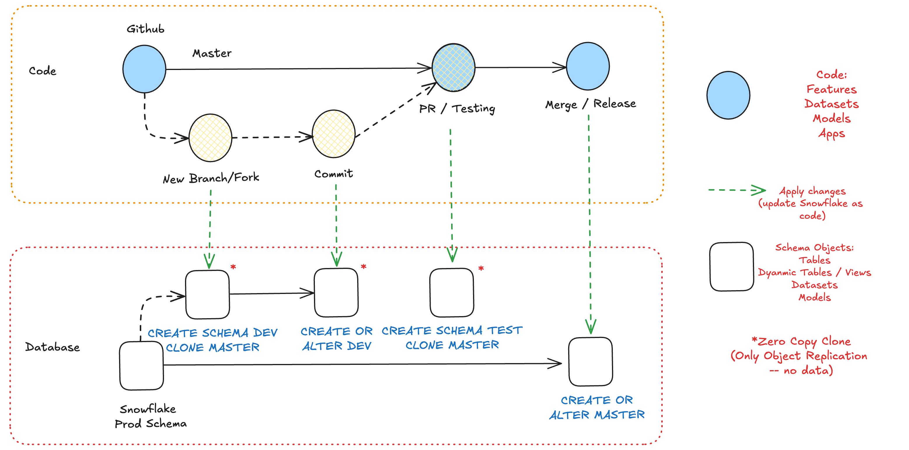

# Snowflake ML Platform: An template repository for MLOps with Snowflake

Snowflakes point of view is that AI & machine learning is a superset of software engineering. The purpose of this repository is be a starting point (and includes a demo) that satisfies all of the requisite software engineering best practices for safely deploying a machine learning model into production using entirely Snowflake primitives.

From feature definitions and transforms to safely testing model-powered applications for production use cases, Snowflake makes it possible for everything to be source controlled and orchestrated as code. Lets dive in!

Much like how standard software code is safely deployed to production, we will:
1. Create a clone of a Snowflake production environment (a database.schema path / namespace)
2. Make changes to the clone such as adding new features, datasets, or models that we want to add to the production environment (via code)
3. Test the clone namespace with the changes to ensure that it is safe to deploy to production (the CI part)
4. Incrementally apply the changes that have been tested and approved to production environment (the CD part)

*In this repository, we will use  Github actions to facilate the CI/CD process. For testing, this will happen on a new PR. For deployment, this will happen on a release. This can certainy be modified to fit your team's MLOps practices.*

The main thing to point out here, which is unique to Snowflake, is that Snowflake's Zero Copy Clone feature allows for us to create a complete replica of the product environment, without having to duplicate any data. This is a key feature that allows us to quickly spin up ulta-cost effective ephermeral environments for development and testing all within you.

The key Snowflake features this ML repo contains includes:
- Snowflake Feature Store (the ability to define features declaratively)
- Snowflake Datasets (the ability to create point-in-time correct immutable datasets for model training)
- Snowflake Model Registry (the ability to performance ultra-scalable inference)

## Table of contents
* [Installation: Running the example](#installation--running-the-example)

## Installation: Running the example
1. Fork the MLPlatform Repo: https://github.com/sfc-gh-madkins/snowflake-mlplatform

2. Go to the repository Settings > Secrets and variables > Actions page and add the following "Repository secrets > New repository secret":
    - SNOWFLAKE_ACCOUNT
    - SNOWFLAKE_USER
    - SNOWFLAKE_PASSWORD
    - SNOWFLAKE_ROLE
    - SNOWFLAKE_WAREHOUSE

3. Go to the repository Settings > Environments and create a "New environment > Add" named: `prod`

4. On the same page, add the following "Environment variables > New environment variable":
    Name: SNOWFLAKE_DATABASE_PROD Value: <your snowflake database>
    Name: SNOWFLAKE_SCHEMA_PROD Value: <your snowflake schema>

  *<your snowflake database>.<your snowflake schema> willl be the namespace where all of the demo assets will land, or, for production, would be the path where all of your snowflake objects would live*

5. Go to the repository Settings > Environments and create a "New environment > Add" named: `test`

6. On the same page, add the following "Environment variables > New environment variable":
Name: SNOWFLAKE_DATABASE_PROD Value: <your snowflake database>
Name: SNOWFLAKE_SCHEMA_PROD Value: <your snowflake schema>

7. Click on the Actions tab and Select that you understand workflows will be enabled

8. Manually trigger the `install-prod-example` Github workflow to setup the initial set of base tables we will build the Snowflake ML Platform on top of.

*The demo data we will be using is related to the Airlines industry. Specifially, there will be 3 tables: US_FLIGHT_SCHEDULES, AIRPORT_WEATHER_STATION, and PLANE_MODEL_ATTRIBUTES, that we will play with in their raw state and look to build a series of features, datasets, and models that solve a "prediciting flight delays" use case*

## Future work
- how does monitoring work?
- how does data quality montiors work?
